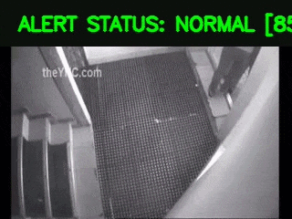
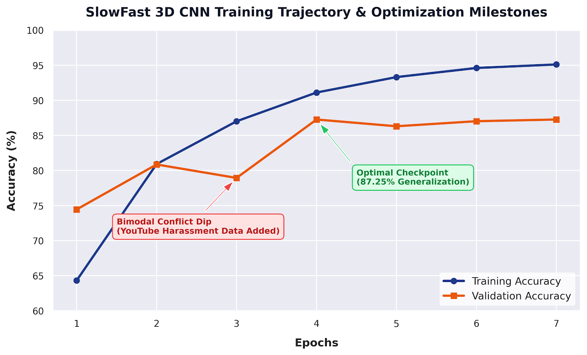

# Behavior Detection: Multi-Stream Intelligent CCTV Surveillance Framework


An end-to-end, multi-stream intelligent CCTV surveillance framework for real-time behavior detection, action recognition, and contextual threat analysis.

The system combines a fine-tuned **SlowFast 3D Convolutional Neural Network** for spatial-temporal behavior recognition with a gated **YOLOv8 Object Detection Engine** for contextual threat analysis and proximity-based vehicle abduction detection.

<p align="center">
  
</p>

<p align="center">
  <em>
  Real-time violence, theft, property damage, and aggression detection using a SlowFast 3D CNN.
  </em>
</p>


Built on an asynchronous **PyQt6** architecture, the framework separates deep-learning inference workloads from the user interface through dedicated background worker threads (`QThread`), enabling responsive and real-time surveillance monitoring across multiple video streams.

---

# 🏗️ System Architecture

Traditional 2D frame-based detection systems often fail to capture temporal information, resulting in poor understanding of complex human activities and increased false alarm rates.

The proposed framework employs a hierarchical multi-modal pipeline:

```text
                           ┌──► Temporal Smooth Voting ──► UI Alert Header
                           │     (15-Frame Sliding Queue)
                           │
[Incoming CCTV Frame] ─────┼──► 3D CNN (SlowFast Core) ──► Action Trigger State
                           │     (Every 8th Frame Step)    (Violence / Aggression)
                           │                                        │
                           │   ┌────────────────────────────────────┘
                           │   ▼ (45-Frame Hysteresis Latch)
                           └──► YOLOv8 Object Detector
                               │ (Dormant During Normal State)
                               ▼
                        Spatial Geometry Analysis
                               │
                               ▼
                     [Distance < 120 Pixels]
                               │
                               ▼
                   🚨 VEHICLE ABDUCTION ALERT
```

---

## 1. Spatial-Temporal Action Recognition

The primary behavior recognition module utilizes a **SlowFast ResNet-50 3D CNN** architecture.

The model consists of two pathways:

* **Slow Pathway** — Low frame rate, rich spatial feature extraction
* **Fast Pathway** — High frame rate, motion-sensitive temporal encoding

Both pathways operate simultaneously using a rolling context window of **32 RGB frames**, allowing the network to learn both appearance and motion dynamics.

---

## 2. Context-Aware Threat Analysis

Certain complex events such as kidnappings or forced vehicle entry cannot be reliably detected using short temporal windows alone.

To address this limitation, the framework introduces a **Gated Spatial Proximity Module** powered by YOLOv8.

### Gated Execution

The object detector remains inactive during normal surveillance operation to reduce computational overhead.

### State Latching

When the SlowFast network detects:

* Violence
* Physical Abuse
* Aggressive Behavior

a hysteresis timer activates YOLOv8 for the next **45 frames**, ensuring stable context tracking even if action predictions fluctuate momentarily.

### Distance-Based Vehicle Interaction Analysis

The detector tracks:

* Person (Class 0)
* Car (Class 2)
* Motorcycle (Class 3)
* Bus (Class 5)
* Truck (Class 7)

Distance between a pedestrian and vehicle is calculated using:

```math
dx = max(vx_1 - px,\;0,\;px - vx_2)
```

```math
dy = max(vy_1 - py,\;0,\;py - vy_2)
```

```math
Distance = \sqrt{dx^2 + dy^2}
```

If:

```math
Distance < 120
```

the system immediately raises a:

🚨 **VEHICLE ABDUCTION ALERT**

---

## 3. Temporal Smoothing & Noise Reduction

Real-world CCTV footage often contains:

* Occlusions
* Motion blur
* Illumination changes
* Detection instability

To suppress label jitter, predictions are accumulated using:

```python
deque(maxlen=15)
```

A threat label is displayed only when it appears at least **twice** within the rolling history window.

This approach improves stability while preserving responsiveness.

---

# 📊 Dataset Engineering

The framework is trained on an engineered version of the **DCSASS Dataset** organized into five target categories:

| Class | Category                    |
| ----- | --------------------------- |
| 0     | Normal Operations           |
| 1     | Violence                    |
| 2     | Theft                       |
| 3     | Property Damage             |
| 4     | Physical Abuse / Aggression |

---

## Class Rebalancing Strategy

Initial dataset analysis revealed significant class imbalance, particularly within the Theft category (>5700 samples).

A soft-capping strategy was introduced:

```math
|P_{class}| > M
```

```math
P_{capped}=Sample(P_{class},n=M,random\_state=42)
```

where:

```math
M = 2500
```

This reduced majority-class dominance and improved generalization performance.

---

# 📈 Training Progress & Optimization Milestones

The SlowFast network was trained for seven epochs on the balanced dataset.

Validation accuracy reached a peak of **87.25% at Epoch 4**, and the corresponding model weights were selected as the final deployment checkpoint. Training continued until Epoch 7 to monitor convergence and overfitting behavior.

<p align="center">
  
</p>

### Key Observations

* Validation accuracy improved from **74.5% to 87.25%**
* Additional harassment samples initially introduced distribution conflict
* Dataset soft-capping improved class balance
* Epoch 4 produced the strongest generalization performance
* Later epochs increased training accuracy while validation performance plateaued, indicating early overfitting

---

# 🎯 Model Performance

| Metric                        | Score      |
| ----------------------------- | ---------- |
| Normal Surveillance           | 88.8% F1   |
| Violence Detection            | 86.1% F1   |
| Theft Detection               | 87.7% F1   |
| Property Damage Detection     | 85.0% F1   |
| Physical Aggression Detection | 87.2% F1   |
| Overall Accuracy              | **87.25%** |

---

## Runtime Performance

| Stage              | Latency |
| ------------------ | ------- |
| SlowFast Inference | 14.2 ms |
| SlowFast + YOLOv8  | 31.5 ms |

The complete pipeline remains below the **40 ms real-time threshold** required for 25 FPS surveillance streams.

---

# 📁 Repository Structure

```text
├── assets/
│   └── training_trajectory.png
│   └── processed_output.gif
│
├── checkpoints/
│   └── slowfast.pth
│
├── models/
│   └── slowfast_model.py
│
├── dataset.py
├── gui.py
├── inference.py
├── train.py
├── utils.py
│
├── yolov8n.pt
├── requirements.txt
└── README.md
```
---
# 📦 Pretrained Models

The repository includes pre-trained weights for immediate inference:

- [Find it here](https://drive.google.com/file/d/1xs4LD7lMXBBhd9UTUOwoQdXNjQu91qZj/view?usp=sharing) — Fine-tuned SlowFast behavior recognition model
- `yolov8n.pt` — YOLOv8 Nano object detection model
---


# 🛠️ Installation

## Clone Repository

```bash
git clone https://github.com/Meet-117/behavior-detection.git
cd behavior-detection
```

## Create Virtual Environment

```bash
python -m venv venv
```

Linux / macOS:

```bash
source venv/bin/activate
```

Windows:

```bash
venv\Scripts\activate
```

## Install Dependencies

```bash
pip install -r requirements.txt
```

Verify CUDA support:

```bash
python -c "import torch; print(torch.cuda.is_available())"
```

---

# 🚀 Running the Application

## Camera Surveillance Dashboard

```bash
python gui.py
```

## Behavior Analysis (SlowFast Only)

```bash
python inference.py
```

Workflow:

1. Select surveillance footage
2. Launch analysis
3. Review detected behaviors and alerts

Supported formats:

* MP4
* AVI
* MKV

---

# 🔗 Dataset

The model was trained on the
[DCSASS Dataset on Kaggle](https://www.kaggle.com/datasets/meetpatel2503/crime-detection-dataset-dcsass-ucf-crime).

---

# Acknowledgements

This project builds upon the contributions of:

* DCSASS Dataset Authors
* Meta AI PyTorchVideo
* Ultralytics YOLOv8

Special thanks to the open-source research community for advancing video understanding and intelligent surveillance systems.
